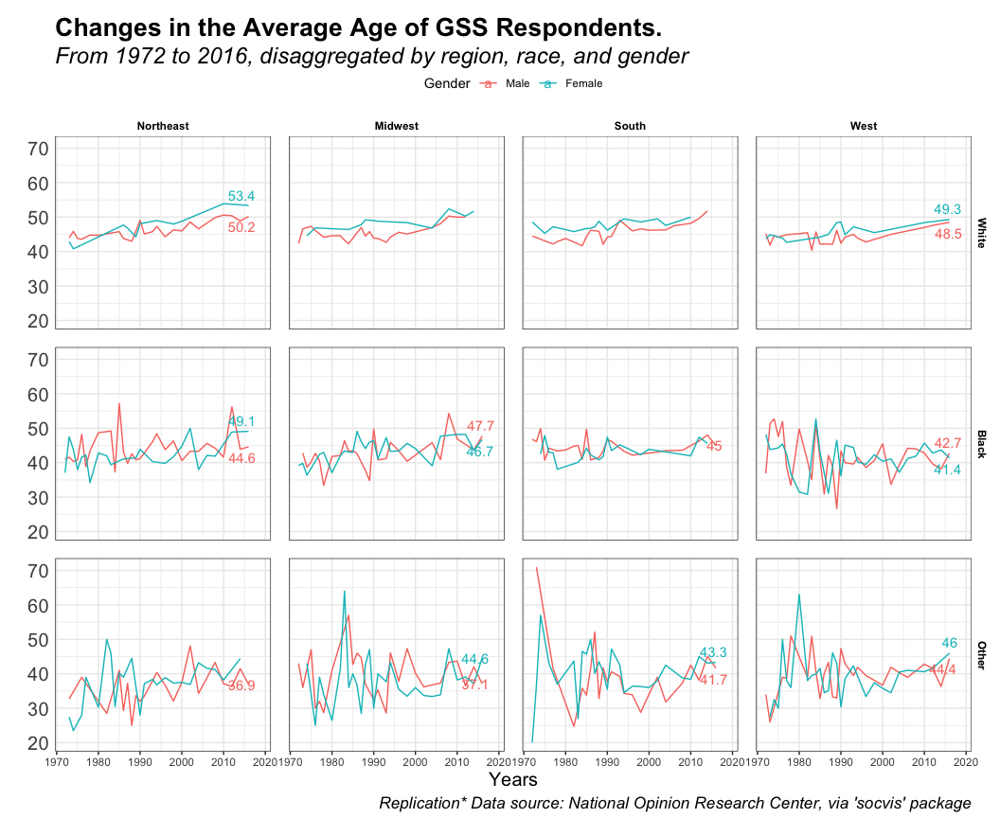

\[Mohammed Alrashidan\]

``` r
library(dplyr)
library(tidyverse)
library(tidyr)
library(here)
library(ggplot2)
library(socviz)
library(ggrepel)
```

``` r
head(gss_lon)
```

    ## # A tibble: 6 x 25
    ##    year    id ballot   age degree  race  sex   siblings kids  bigregion income16
    ##   <dbl> <dbl>  <dbl> <dbl> <fct>   <fct> <fct> <fct>    <fct> <fct>     <fct>   
    ## 1  1972     1     NA    23 Bachel… White Fema… 3        0     Midwest   <NA>    
    ## 2  1972     2     NA    70 Lt Hig… White Male  4        4+    Midwest   <NA>    
    ## 3  1972     3     NA    48 High S… White Fema… 5        4+    Midwest   <NA>    
    ## 4  1972     4     NA    27 Bachel… White Fema… 5        0     Midwest   <NA>    
    ## 5  1972     5     NA    61 High S… White Fema… 2        2     Midwest   <NA>    
    ## 6  1972     6     NA    26 High S… White Male  1        0     Midwest   <NA>    
    ## # … with 14 more variables: religion <fct>, marital <fct>, padeg <fct>,
    ## #   madeg <fct>, partyid <fct>, polviews <fct>, happy <fct>, partners_rc <fct>,
    ## #   grass <fct>, zodiac <fct>, pres12 <dbl>, wtssall <dbl>, vpsu <dbl>,
    ## #   vstrat <dbl>

``` r
# calculate the average age
new_data <- gss_lon %>%
  filter(year >= 1972 & year <= 2016) %>%
  rename(Gender = sex) %>%
  group_by(bigregion, race, Gender, year) %>%
  summarise(avg_age = round(mean(age),1)) %>%
  drop_na() %>%
  ungroup()
head(new_data)
```

    ## # A tibble: 6 x 5
    ##   bigregion race  Gender  year avg_age
    ##   <fct>     <fct> <fct>  <dbl>   <dbl>
    ## 1 Northeast White Male    1973    44  
    ## 2 Northeast White Male    1974    45.9
    ## 3 Northeast White Male    1975    43.8
    ## 4 Northeast White Male    1976    43.6
    ## 5 Northeast White Male    1978    44.8
    ## 6 Northeast White Male    1980    44.7

``` r
p0 <- ggplot(data = new_data, 
             mapping = aes(y = avg_age, na.rm=TRUE, 
                           x = year, fill = Gender, label = avg_age)) + 
  facet_grid(race ~ bigregion) 

p1 <- p0 + geom_line(data = new_data, 
             mapping = aes(y = avg_age, na.rm=TRUE, 
                           x = year, 
                           fill =Gender, 
                           color = Gender)) 

p2 <- p1 + geom_text_repel(data = subset(new_data, year >= last(new_data$year)), 
                           aes(color = Gender,
                               x = year +3,
                               y = avg_age,
                               label = avg_age))
p3 <- p2 + 
  theme_bw() + 
  theme(panel.spacing = unit(0.5, "cm"),
        strip.text = element_text(color = "black", face = "bold"),
        strip.background = element_rect(fill = "white", colour = "white", size = 1))


p4 <- p3 + 
  labs(x = "Years", y = "Respondents' Average Age",
       title = "Changes in the Average Age of GSS Respondents.",
       subtitle = "From 1972 to 2016, disaggregated by region, race, and gender",
       caption = "Replication* Data source: National Opinion Research Center, via 'socvis' package") +
  theme(legend.position="top",
        plot.title=element_text(size=20, face="bold", colour="black", vjust=-1),
        plot.subtitle=element_text(size=18, face="italic", color="black", vjust=-1),
        plot.caption =element_text(size=13, face="italic", color="black"),
        axis.ticks.y = element_blank(), 
        axis.text.y = element_text(size=15),
        axis.title.y= element_text(size=15, vjust=8, hjust=0.5),
        axis.title.x= element_text(size=15))

p4 
```

<!-- -->
